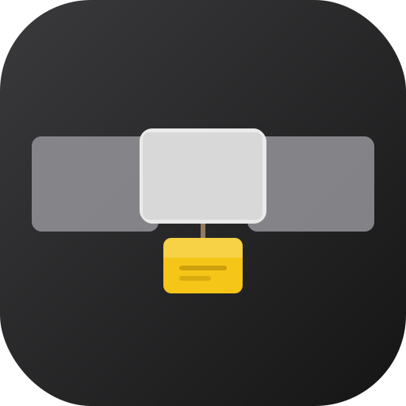
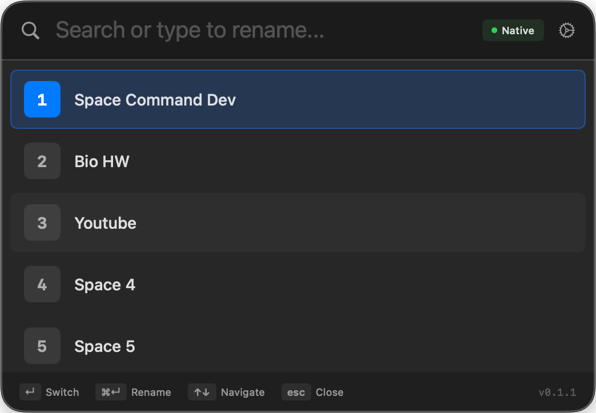
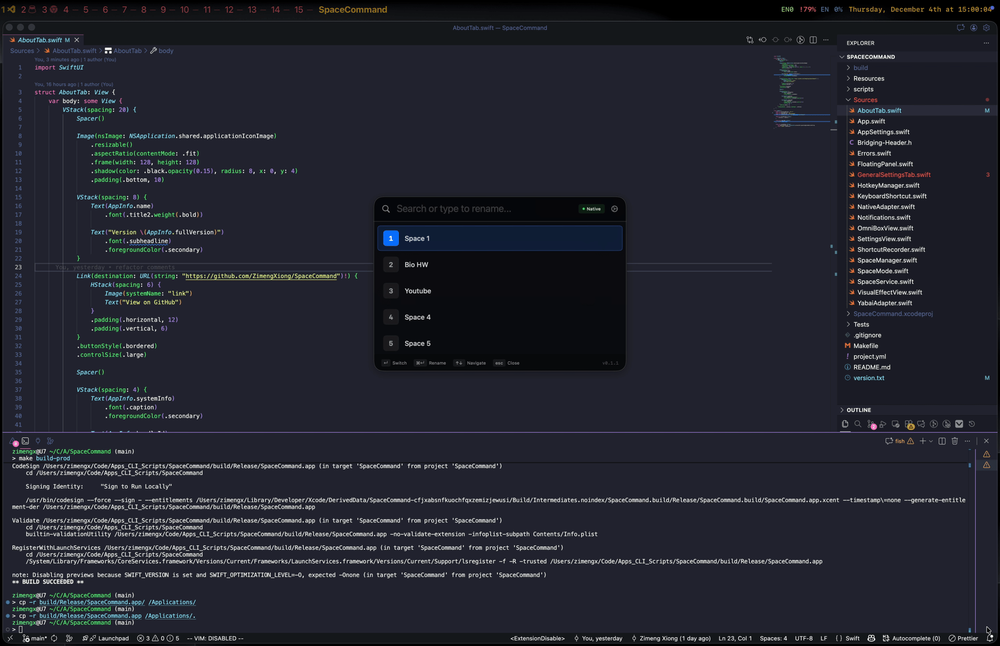

# SpaceCommand v0.1.1


A macOS utility for navigating and managing spaces/workspaces by name with support for both Yabai and native macOS modes.



## Table of Contents
- [Features](#features)
- [Installation](#installation)
  - [Homebrew (Recommended)](#homebrew-recommended)
  - [Build from Source](#build-from-source)
- [Usage](#usage)
- [Label System](#label-system)
- [Backends](#backends)
  - [Yabai Backend](#yabai-backend)
  - [Native macOS Backend](#native-macos-backend)
  - [Why Yabai is Preferred](#why-yabai-is-preferred)
- [Project Structure](#project-structure)

## Features

<details>
<summary>Switch to spaces by name</summary>


Quickly navigate to any space via fuzzyfind

</details>

<details>
<summary>Rename spaces</summary>



Easily rename your spaces
</details>

## Installation

### Homebrew (Recommended)
```bash
brew install --cask ZimengXiong/SpaceCommand
```

> **Note**: [Yabai](https://github.com/koekeishiya/yabai) is preferred over native macOS backend for better reliability and performance. See [Backends](#Backends) for details.

## Build from Source

#### Prerequisites
- macOS 14.0 or later
- Xcode 15.0 or later
- Swift 5.9 or later
- [xcodegen](https://github.com/yonaskolb/XcodeGen) (for project generation)

#### Build Instructions
```bash
# Clone the repository
git clone https://github.com/ZimengXiong/SpaceCommand
cd SpaceCommand

# Generate Xcode project
make gen

# Build the application
make build

# Run the application
make run
```

#### Build for Production
```bash
# Generate Xcode project
make gen

# Build production version
make build-prod

# The built app will be in build/Release/SpaceCommand.app
```


## Usage
- **Cmd+Shift+Space**: Toggle SpaceCommand panel
- **Cmd+,**: Open settings


## Label System

<details>
<summary>Label System Details</summary>

SpaceCommand uses **app storage labels** that are stored in the application's preferences, not Yabai's native labels.

1. All space labels are stored in `AppSettings.shared.spaceLabels` dictionary
2. Both Yabai and Native backends use the same app storage system
3. Spaces are switched by **space number/index**, not by label name
4. When using Yabai, if a space has a Yabai native label, it's imported into app storage on first use

This provides consistent labeling across both backends and ensures labels persist even when switching between Yabai and Native modes.
</details>

## Backends

<details>
<summary>Yabai Backend</summary>

The Yabai backend uses the [yabai](https://github.com/koekeishiya/yabai) window management tool to interact with macOS spaces. It provides:

- Uses Yabai's CLI interface to query and switch spaces
- Imports Yabai's native labels into app storage on first use
- Uses Yabai's built-in space focusing commands by index with fallback to label-based switching
- Communicates with Yabai via JSON for space information
- Searches common installation paths and uses `which yabai` for detection

The Yabai adapter automatically detects Yabai installation in common locations and uses shell commands to interact with it.
</details>

<details>
<summary>Native macOS Backend</summary>

The native macOS backend uses Apple's private Core Graphics APIs and AppleScript to manage spaces, it is not recommended:

- Uses `CGSCopyManagedDisplaySpaces()` to query space information
- Simulates keyboard shortcuts (Ctrl+1-10) to switch spaces by index
- Requires Accessibility and Automation permissions for full functionality
- Fallbacks between CGEvents and Applescript for space switching.
</details>

<details>
<summary>Why Yabai is Preferred</summary>

Yabai is preferred over the native backend for several reasons:

1. **Reliability**: Yabai provides a stable, documented API for space management
2. **Performance**: Direct CLI communication is faster than CGEvent/AppleScript
3. **Full Feature Support**: Yabai supports all space operations "natively"

The native backend is more buggy than Yabai, switch spaces slower, and may break in future macOS updates.
</details>

## Project Structure
```
SpaceCommand/
├── Resources/                 # App resources
│   ├── AppIcon.svg            # App icon
│   ├── Info.plist             # App configuration
│   └── Assets.xcassets/       # App assets
├── Sources/                   # Swift source code
│   ├── App.swift              # Main application
│   ├── SpaceManager.swift      # Space management logic
│   ├── YabaiAdapter.swift     # Yabai integration
│   ├── NativeAdapter.swift     # Native macOS integration with accessibility and automation permissions
│   └── ...                    # Other source files
├── Tests/                     # Unit tests
├── scripts/                   # Build scripts
│   ├── bump-build.sh          # Build version bump
│   ├── bump-major.sh          # Major version bump
│   ├── bump-minor.sh          # Minor version bump
│   ├── bump-patch.sh          # Patch version bump
│   └── ...                    # Other scripts
├── Makefile                   # Build commands
├── project.yml                # Project configuration
└── README.md                  # This file
```